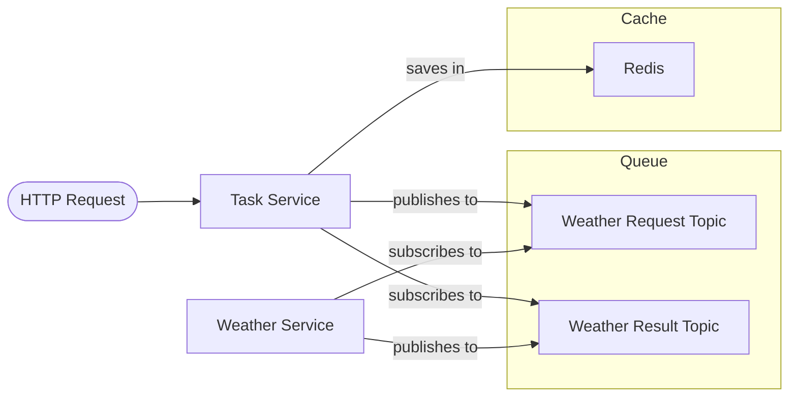

# Using Dapr in Python applications

This example repository shows how to use Dapr in Python applications.

The idea is to have a task service that queries the weather service for the weather in a given location.

Communication between two services is decoupled using a message queue (RabbitMQ). Redis is used to cache the state of the task service.



## Getting Started

Initialize Dapr and start the infrastructure:

```shell
dapr init
./start-infrastructure.sh # starts additional components, e.g. RabbitMQ
```

In a new terminal, run the first service:

```shell
cd task-service && ./start.sh 
```

In another terminal, run the second service:

```shell
cd ../weather-service && ./start.sh
```

Query the task service:

```shell
curl http://localhost:8000/weather/tartu -X POST
# after a few seconds
curl http://localhost:8000/weather/tartu
```

## Used Dapr building blocks

The following Dapr building blocks are used in this example (more to come):

- [ ] Service invocation
- [x] State management
- [x] Publish & subscribe messaging
- [x] Bindings
- [ ] Actors
- [ ] Observability
- [x] Secrets management
- [ ] Configuration
- [ ] Distributed lock
- [ ] Workflow
- [ ] Cryptography
